# Capistra

**Self-hosted Personal Accounting, Cash-Flow & Investment Management Platform**

Capistra is a PHP + MySQL web application that you run on your own server. It
combines a double-entry accounting core with cash-flow tracking and multi-asset
investment records in a single, self-hosted codebase — so personal and operating
finances live in one place instead of being spread across a bookkeeping tool and
a separate investment spreadsheet.

Capistra is an open-source **portfolio / learning project**. It is *not* certified
accounting, tax or financial-advisory software, it is not "enterprise grade", and
it is not a hosted service.

> **The public repository ships FICTIONAL demonstration data only.**
> Every name, company, email, phone number, account number and amount in
> `database/demo_seed.sql` is invented. See [Demo & Production Warning](#demo--production-warning).

---

## Project Evolution

Honesty about where this code came from matters, so here it is.

Capistra began roughly **three years ago as an early PHP/MySQL learning project**
under the internal name **GMIC**. The original code was written while learning the
basics: PHP, MySQL, CRUD screens, session authentication, financial forms,
dashboard layouts, file handling and printable reports.

Over time it accumulated modules for income, expenses, investments (stocks,
businesses, loans, real estate), clients/customers, employees, billing, employee
records and investor/fund records. Some of those modules still carry the shape of
that learning phase.

In **2026** the project was revisited and reworked into what you see today:

- removed private and company-specific data from the codebase;
- renamed the product from **GMIC** to **Capistra** and centralised the brand;
- added a **fictional public demo dataset** so the app can be shared safely;
- centralised configuration (`.env` + `config/app.php`) instead of ad-hoc settings;
- improved the authentication and session foundations;
- introduced proper **accounting primitives** (chart of accounts, journal, periods);
- linked income and expenses to a **double-entry ledger**;
- added financial statements (trial balance, P&L, balance sheet, cash flow);
- added a **Finance & Capital Command Center** dashboard;
- added **scenario / liquidity planning**;
- added documentation, CI, security and contribution files;
- prepared the codebase for public learning and further development.

**This remains an evolving project.** Some legacy modules still reflect the
original learning-project architecture and are being progressively modernised.
That mix — old and new side by side — is part of what makes the repository useful
to read.

---

## What Makes Capistra Different?

No single idea here is unique. The point of difference is the **combination** of
them inside one self-hosted application that you fully control.

### Accounting + Personal Finance

Rather than only recording expenses, Capistra now links money movement to a real
ledger:

- income and expense records;
- cash-flow tracking;
- chart of accounts;
- double-entry journal;
- general ledger;
- trial balance;
- profit & loss;
- balance sheet;
- cash-flow reporting;
- budgets, recurring transactions, goals, transfers and reconciliations.

### Accounting + Investment Tracking

The same project also records several investment classes — **stocks, business
investments, loan investments and real-estate investments** — so the dashboard can
put operating finances and capital allocation side by side instead of treating
them as unrelated.

### Nepal / NEPSE Origins

Capistra grew out of a Nepal-based context, so it ships Nepal-focused
stock-investment concepts and **NPR-first** financial formatting (the base
currency is configurable). A NEPSE-oriented master-data and market-data model
exists, but it is **still an area of active improvement** — see
[Current Limitations](#current-limitations--roadmap). There is **no verified live
official NEPSE integration**; market data is optional and best-effort.

### Finance & Capital Command Center

The modernised dashboard combines, on one screen: cash position, income,
expenses, net result, assets, liabilities, equity, investment cost, portfolio
value and investor/fund capital.

### Scenario Planner

A planning screen lets you model simple scenarios — expected income, operating
expenses, planned investment, loan repayment and a cash-reserve target — to see
projected surplus or deficit.

> The planner is a **planning utility only**. It does not provide financial,
> tax or investment advice.

### Self-hosted

- PHP + MySQL/MariaDB; no mandatory SaaS service;
- runs comfortably on XAMPP (or any Apache + PHP + MySQL stack);
- your data stays on your own machine or server;
- the code can be inspected, forked and modified.

### Learning-Friendly Open Source

Because the codebase evolved from an early learning project, developers can study
**both** the legacy procedural PHP patterns **and** the newer structured
accounting/configuration architecture — and see exactly how a project like this
grows up over time.

---

## Current Feature Status

Statuses reflect what the current source actually supports.

| Feature | Status | Notes |
|---|---|---|
| Authentication (login, sessions, OTP, password reset) | Implemented | `password_hash()`/`password_verify()`, CSRF, session hardening |
| Financial dashboard | Implemented | `admin/index.php` (legacy AdminLTE-era layout) |
| Income management | Implemented (legacy UI) | `admin/Income/income.php`; posts to the ledger |
| Expense management | Implemented (legacy UI) | `admin/Expense/expense.php`; posts to the ledger |
| Chart of accounts | Implemented | `accounting/chart-of-accounts.php` |
| Journal | Implemented | `accounting/journal.php`; entries must balance |
| General ledger | Implemented | `accounting/general-ledger.php` |
| Trial balance | Implemented | `accounting/trial-balance.php` |
| Profit & loss | Implemented | `accounting/profit-loss.php` |
| Balance sheet | Implemented | `accounting/balance-sheet.php` |
| Cash flow | Implemented | `accounting/cash-flow.php` |
| Finance & Capital Command Center | Implemented | `accounting/index.php` |
| Scenario planner | Implemented | `accounting/planner.php` (planning utility only) |
| Settings Center | Implemented | `admin/settings/` — currency, features, categories, accounts, fiscal periods |
| Personal finance (budgets, goals, recurring, transfers, tags, reconciliation) | Implemented | `admin/finance/` |
| Stock investments | Experimental / evolving | Legacy `admin/investment/stock.php` plus a newer `portfolios`/`stock_transactions` model |
| Business investments | Legacy / evolving | `admin/investment/business.php` |
| Loan investments | Legacy / evolving | `admin/investment/loan.php` |
| Real-estate investments | Legacy / evolving | `admin/investment/real_estate.php` |
| Investor / fund management | Legacy / evolving | `admin/fund/` — investors, terms, returns |
| Customers | Data model only | The `customers` table is used by billing/accounting; the legacy KYC onboarding UI is not part of the public build |
| Employees | Implemented (legacy UI) | `admin/employee/` |
| Billing / invoices | Legacy / evolving | `admin/billing/` |
| NEPSE master data (exchanges, sectors, securities, prices) | Experimental | Database-backed; seed import marks rows `unverified` |
| Audit log | Implemented | Accounting mutations recorded |
| Database backup | Partial / evolving | Backup + scheduler scripts read the canonical `.env` config; the scheduler is CLI-only |

---

## Tech Stack

- **PHP 8** (procedural + PDO/mysqli), no framework
- **MySQL / MariaDB**
- **Apache** (XAMPP-friendly)
- **JavaScript** — plain DOM scripts, plus bundled jQuery/AdminLTE plugins
- **Bootstrap / AdminLTE** for the legacy admin areas; a newer design-system-based
  CSS layer (`assets/css/capistra.css`) for the accounting module
- **Composer** for optional packages only: `phpmailer/phpmailer`,
  `setasign/fpdf`, `google/apiclient`

There is no Laravel/Symfony/etc. in this project.

---

## Project Structure

```
capistra/
├── accounting/                 New accounting & capital module
│   ├── index.php               Finance & Capital Command Center
│   ├── chart-of-accounts.php
│   ├── journal.php
│   ├── general-ledger.php
│   ├── trial-balance.php
│   ├── profit-loss.php
│   ├── balance-sheet.php
│   ├── cash-flow.php
│   ├── ledger-sync.php
│   ├── planner.php
│   └── lib/                    auth, integrate, layout, ledger
├── admin/                      Legacy admin modules
│   ├── Income/  Expense/
│   ├── investment/             stocks, business, loans, real estate
│   ├── finance/                budgets, goals, recurring, transfers, tags, reconcile
│   ├── fund/                   investor / fund records
│   ├── billing/  employee/
│   ├── settings/               Settings Center
│   ├── dis/                    legacy NEPSE scraper utilities
│   └── ...                     assets, includes, page, service, head
├── assets/css/                 capistra.css design tokens
├── config/                     app.php, env.php, autoload.php, session.php,
│                               features.php, settings.php
├── database/
│   ├── schema.sql
│   ├── demo_seed.sql
│   ├── migrations/001_dynamic_foundation.sql
│   └── README.md
├── design-system/              capistra-public-accounting-platform/MASTER.md
├── docs/                       audits + docs/images/
├── includes/                   shared CSS + backup configuration loader
├── lib/                        categories, financial_accounts, nepse, periods,
│                               personal_finance, portfolio, transfers, csv
├── protect/                    login, signup, OTP and password-reset flows
├── scripts/                    migrate_nepse_seed.php + Windows backup helpers
├── tests/run-tests.php
├── .github/workflows/ci.yml
├── index.php                   Login
├── iiiindex.php                Public project landing page
├── .env.example
├── composer.json
├── README.md
├── SECURITY.md
├── CONTRIBUTING.md
├── THIRD_PARTY_NOTICES.md
└── LICENSE
```

---

## Main Application Areas

Paths are relative to your install (example base `http://localhost/capistra`).
Only routes that exist today are listed.

| Area | Path |
|---|---|
| Login | `/` |
| Dashboard | `/admin/` |
| Finance & Capital Command Center | `/accounting/` |
| Chart of Accounts | `/accounting/chart-of-accounts.php` |
| Journal | `/accounting/journal.php` |
| General Ledger | `/accounting/general-ledger.php` |
| Trial Balance | `/accounting/trial-balance.php` |
| Profit & Loss | `/accounting/profit-loss.php` |
| Balance Sheet | `/accounting/balance-sheet.php` |
| Cash Flow | `/accounting/cash-flow.php` |
| Scenario Planner | `/accounting/planner.php` |
| Income | `/admin/Income/income.php` |
| Expenses | `/admin/Expense/expense.php` |
| Investments | `/admin/investment/index.php` |
| Stock Investment | `/admin/investment/stock.php` |
| Personal Finance | `/admin/finance/` |
| Investor / Fund | `/admin/fund/fundmanagement.php` |
| Settings Center | `/admin/settings/` |

---

## Installation (Windows + XAMPP)

### Prerequisites

- XAMPP (Apache + PHP 8 + MySQL/MariaDB), or an equivalent LAMP stack
- Composer (optional — only needed for PDF and email features)

### Steps

1. **Clone into your web root** so the folder is named `capistra`:

   ```bash
   cd C:/xampp/htdocs
   git clone https://github.com/youvrajgit1432/capistra.git
   ```

2. **Install optional dependencies:**

   ```bash
   cd C:/xampp/htdocs/capistra
   composer install
   ```

3. **Create your environment file:**

   ```bash
   cp .env.example .env
   ```

   Then set at least `APP_URL`, `DB_HOST`, `DB_NAME`, `DB_USER` and
   `DB_PASSWORD`. Because the folder is named `capistra`, the default
   `APP_URL` should be:

   ```
   APP_URL="http://localhost/capistra"
   ```

4. **Create the database and import the schema + demo data:**

   ```bash
   mysql -u root -p -e "CREATE DATABASE capistra CHARACTER SET utf8mb4 COLLATE utf8mb4_unicode_ci;"
   mysql -u root -p capistra < database/schema.sql
   mysql -u root -p capistra < database/demo_seed.sql
   ```

   (In phpMyAdmin, import the two files in the same order.)

5. **Start Apache and MySQL**, then open:

   ```
   http://localhost/capistra/
   ```

More database detail: [`database/README.md`](database/README.md).

> Note: the author's own development copy still lives in
> `C:\xampp\htdocs\gmic` served at `http://localhost/gmic`. That is a local
> path only — a fresh clone should use the `capistra` slug exactly as above.

---

## Demo Account (LOCAL DEMO ONLY — FICTIONAL DATA)

| Field | Value |
|---|---|
| URL | `http://localhost/capistra/` |
| Username | `demo_admin` |
| Email | `demo@example.test` |
| Password | `Demo@12345` |

This account and the seed database contain **fictional data only**. The password
is stored as a `password_hash()` value, never plaintext. It is a local
demonstration credential and is **not** suitable for production — see below.

---

## Demo & Production Warning

The included demo account and seed database contain fictional data only.

Before using Capistra with real data:

- change the administrator credentials and remove the demo account;
- review `.env` and set a strong `APP_KEY` and real database credentials;
- disable `APP_DEBUG` and set a production environment;
- serve the site over HTTPS and enable secure cookies;
- review filesystem and directory permissions;
- review email configuration before enabling OTP/notifications;
- review upload and storage settings, and keep uploads out of version control;
- back up your data securely and test the restore path.

Capistra is **not** financial, tax or investment advice.

---

## Current Limitations / Roadmap

Being transparent about the rough edges (see
[`docs/LEGACY_AUDIT.md`](docs/LEGACY_AUDIT.md) for the route-by-route legacy
audit and market-data review):

- some legacy modules still use the older procedural PHP architecture;
- newer admin screens share a single `capistra_admin_guard()`, and the legacy
  investor/fund and market-data areas now enforce the shared session guard on
  direct requests; a deployment should still be reviewed before exposing Capistra
  to an untrusted network;
- several admin screens still use the AdminLTE-era layouts;
- stock master data still needs further normalisation;
- market-data integration is optional and best-effort (no verified live NEPSE feed);
- automated browser coverage is still thin — the published screenshots are
  captured manually from the demo build and are not asserted in CI;
- the dynamic personal-finance settings are still evolving;
- mobile polish across the legacy screens can be improved;
- deeper automated accounting tests (statement reconciliation, edge cases) can be added.

---

## Running the Tests

```bash
# PHP syntax check across the project
find . -name '*.php' -not -path './vendor/*' -exec php -l {} \;

# Financial-logic tests
php tests/run-tests.php
```

---

## Contributing

Capistra is open source and intended for learning, experimentation and further
development. You are welcome to **fork, clone, modify, extend and submit pull
requests**, subject to the repository [license](#license).

See [`CONTRIBUTING.md`](CONTRIBUTING.md) for the workflow. The one rule that
matters most: **never commit real data** — no customer/KYC data, uploads,
database dumps or secrets.

---

## Security

- `password_hash()` / `password_verify()` for credentials; never plaintext.
- Prepared statements for database access.
- CSRF tokens on state-changing forms.
- Secure sessions (`HttpOnly`, `SameSite`, id regeneration, inactivity timeout).
- Output escaping and input validation.
- Audit trail for accounting mutations.
- **No credential vault:** the application does not store email/bank passwords,
  security answers or OTP secrets.

To report a vulnerability, see [`SECURITY.md`](SECURITY.md). Third-party
components and their licences are listed in
[`THIRD_PARTY_NOTICES.md`](THIRD_PARTY_NOTICES.md).

---

## Screenshots

All screenshots come from the **fictional demo database** (`demo_admin`); nothing
shown is real data. Desktop captures are 1440 × 900, the mobile capture is
390 × 844.

### Dashboard

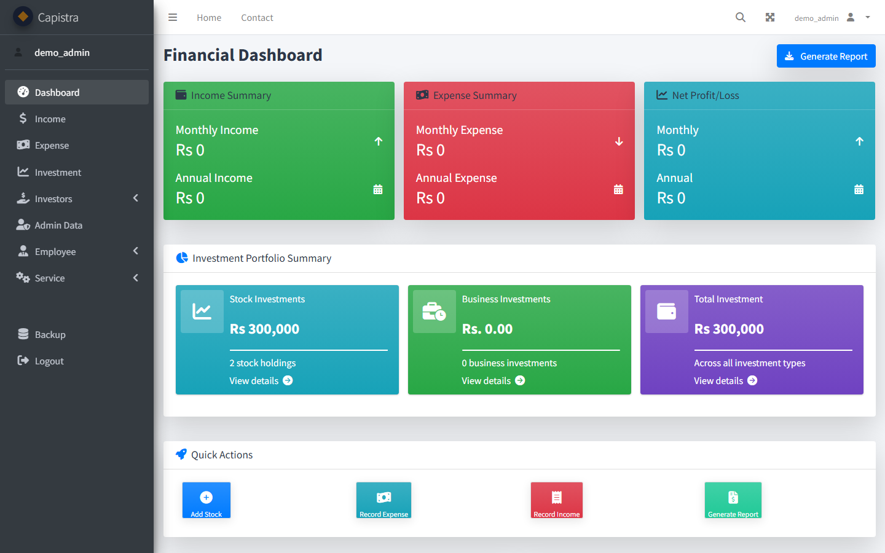

### Accounting

| Chart of accounts | General ledger |
|---|---|
| 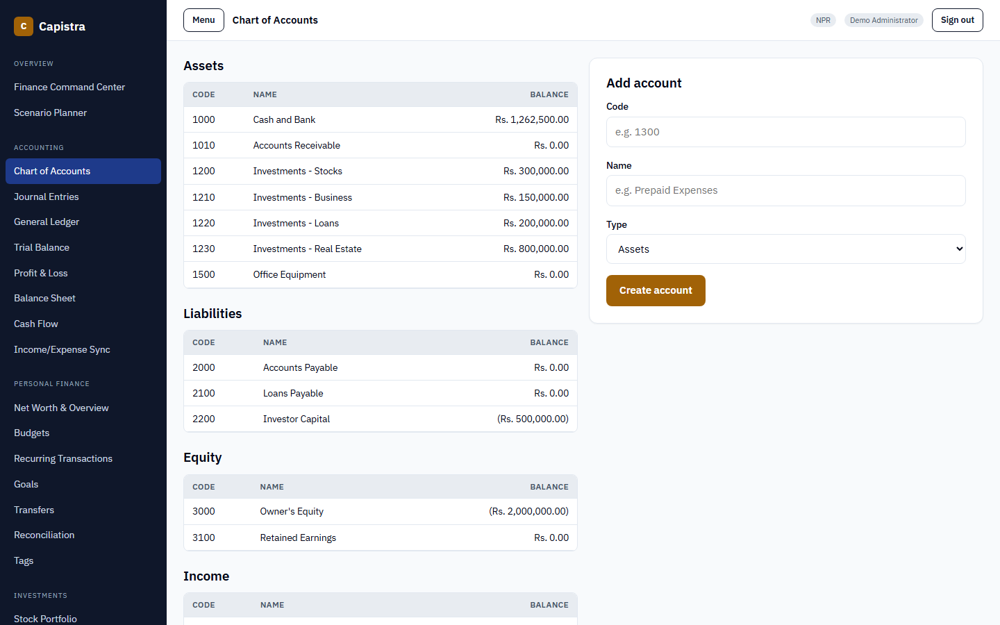 | 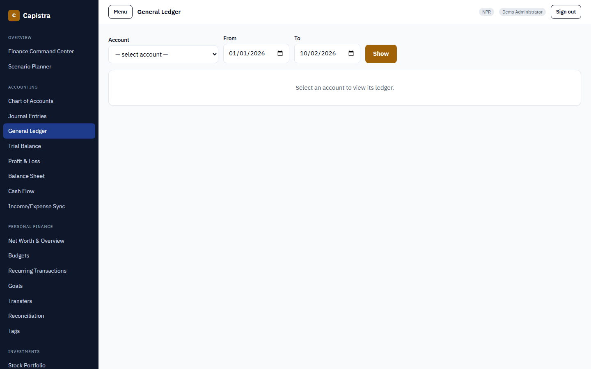 |

| Trial balance | Profit & loss |
|---|---|
| 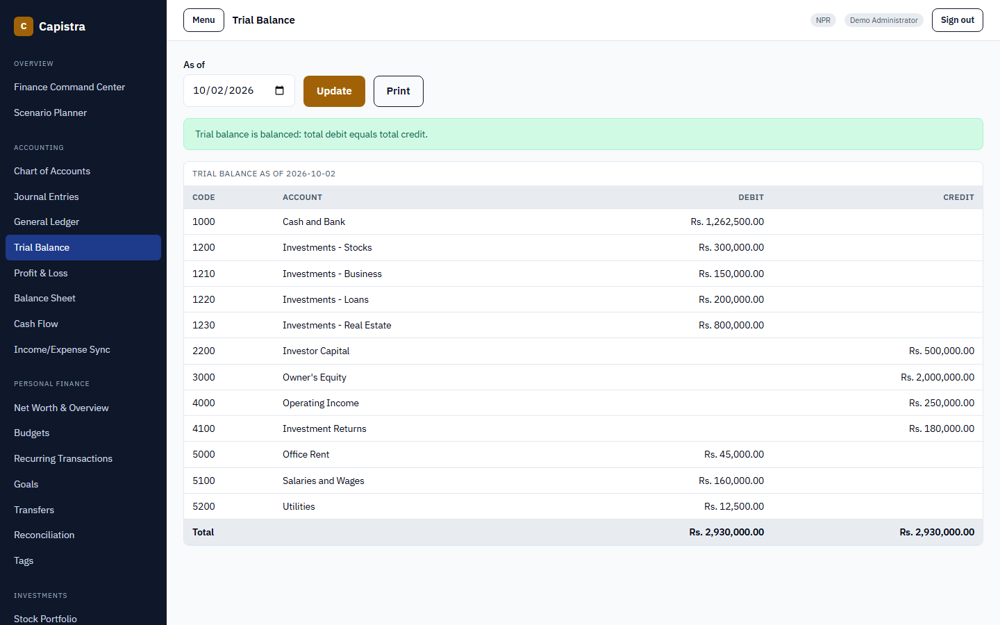 | 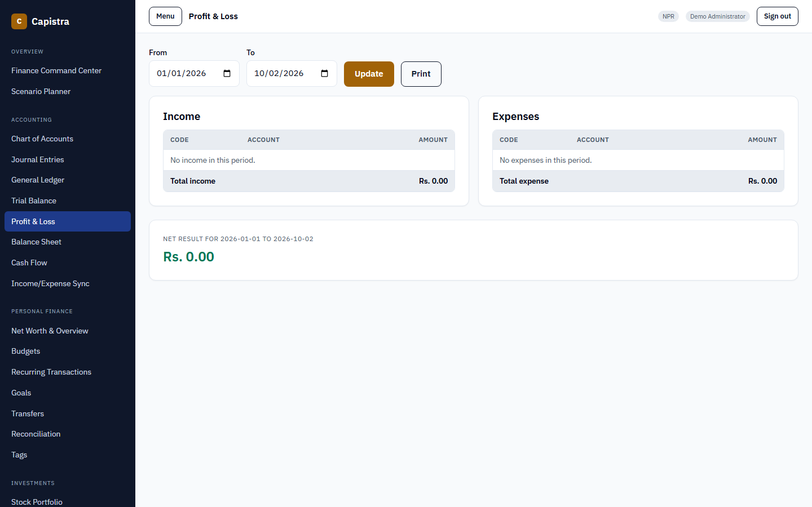 |

| Balance sheet | Finance & Capital Command Center |
|---|---|
| 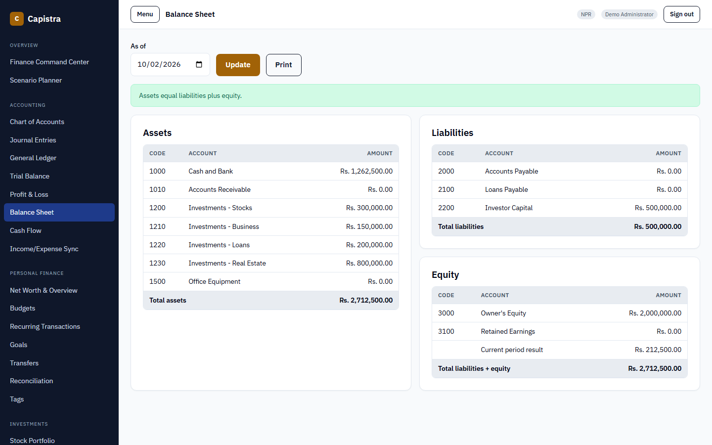 | 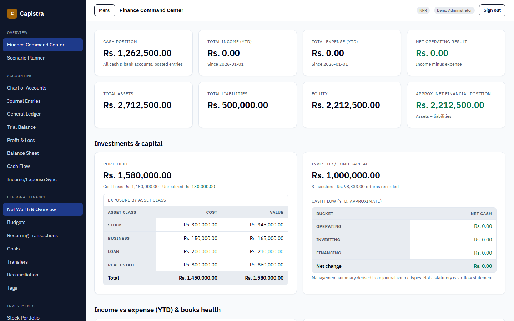 |

### Income, Expenses & Cash Flow

| Income | Expenses |
|---|---|
| 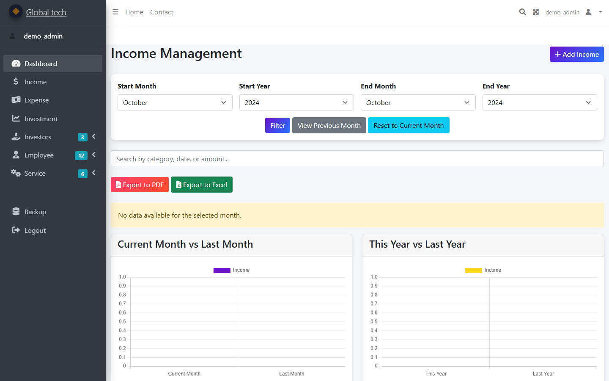 | 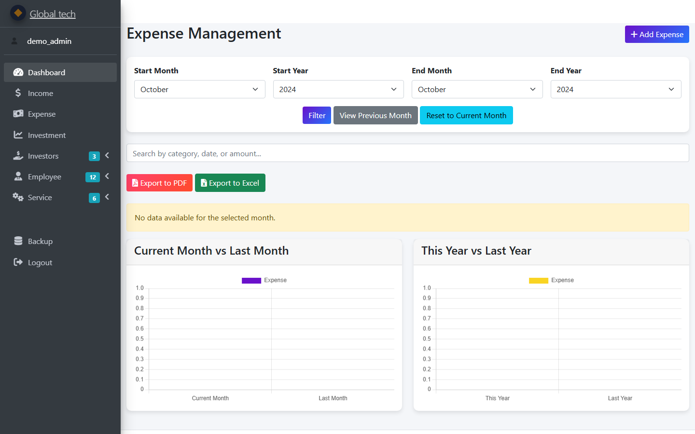 |

| Cash flow | Scenario planner |
|---|---|
| 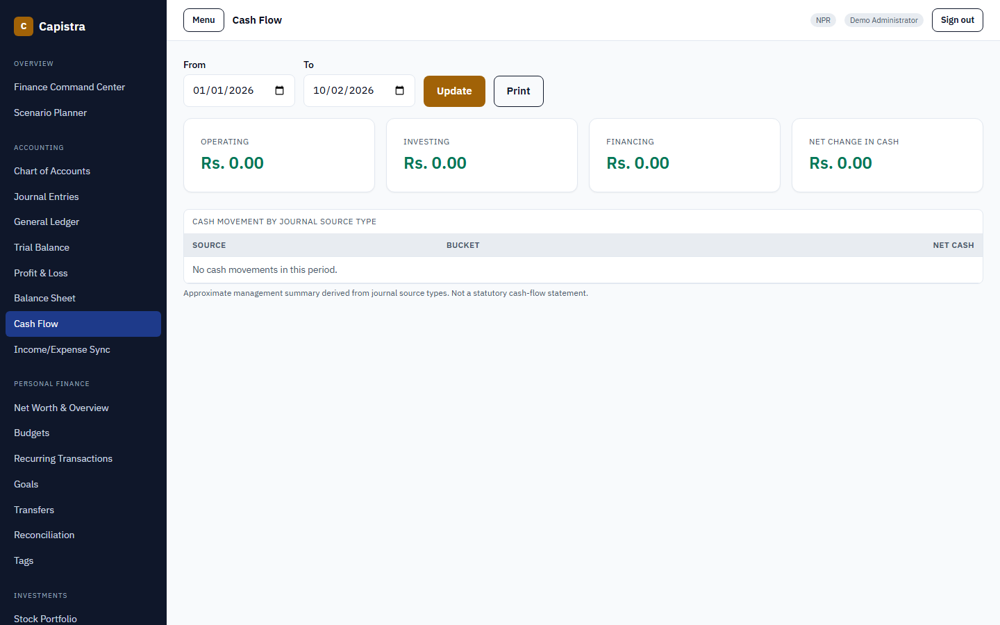 | 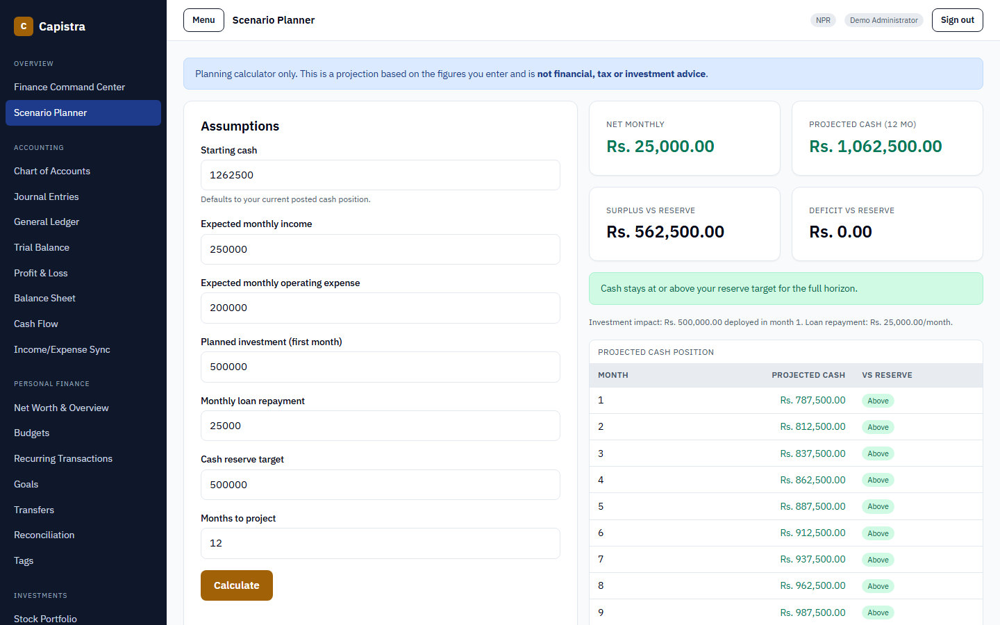 |

### Investments

| Investment dashboard | Stock investments |
|---|---|
| 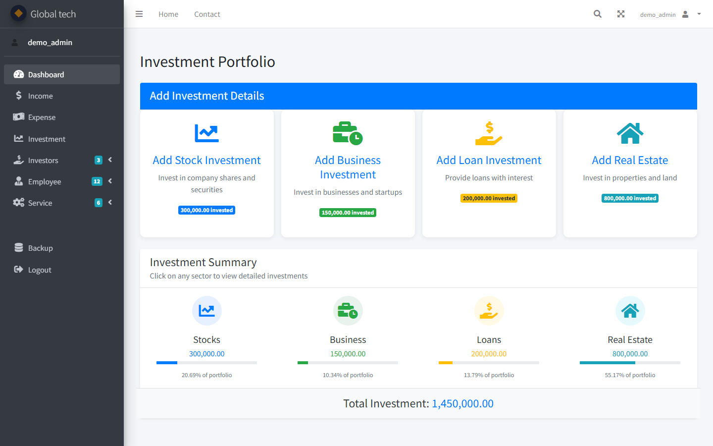 | 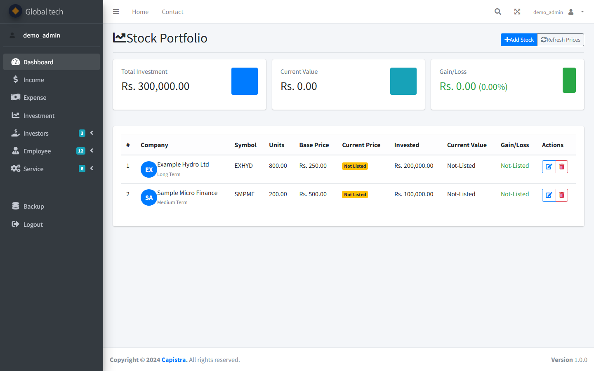 |

### Settings

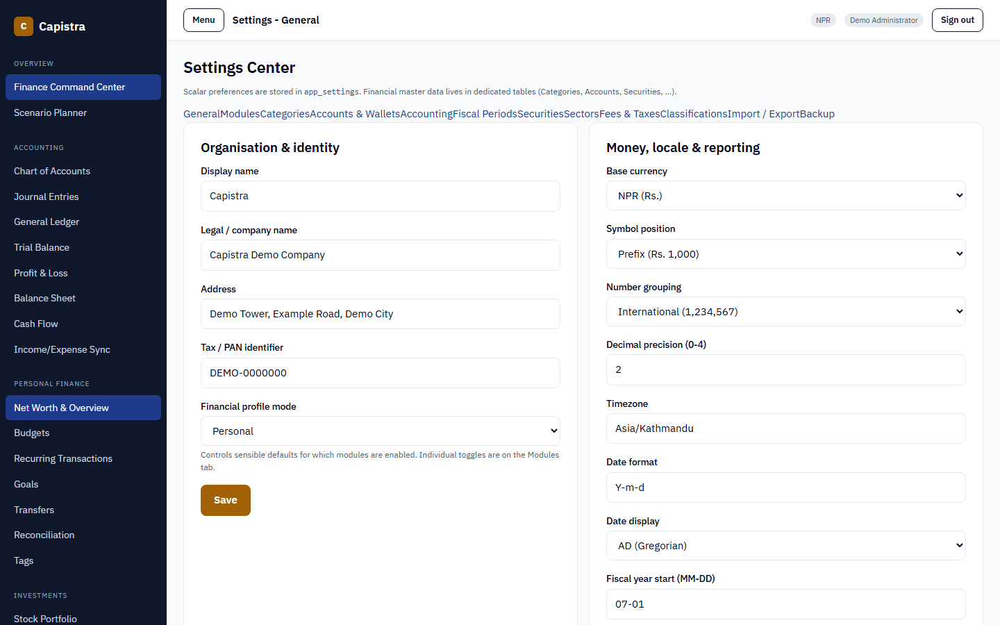

### Login & mobile

| Login | Dashboard (mobile) |
|---|---|
| 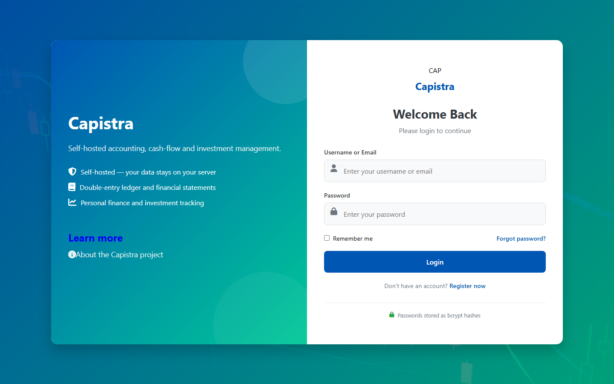 | 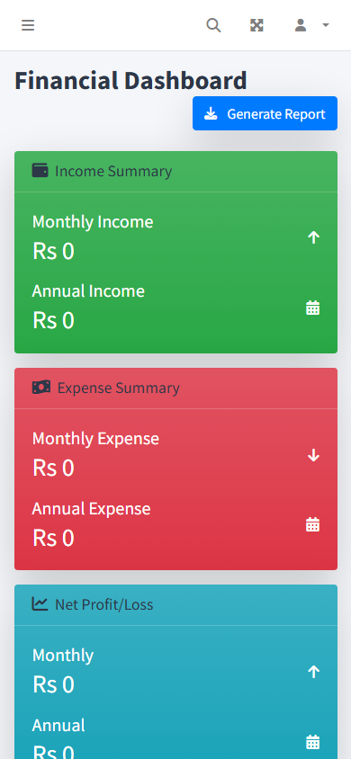 |

See `docs/images/README.md` for the naming convention. Every image referenced
above exists in `docs/images/`.

---

## License

Released under the [MIT License](LICENSE). This permits use, modification and
redistribution subject to the licence terms. Bundled third-party components
retain their own licences — see [`THIRD_PARTY_NOTICES.md`](THIRD_PARTY_NOTICES.md).
